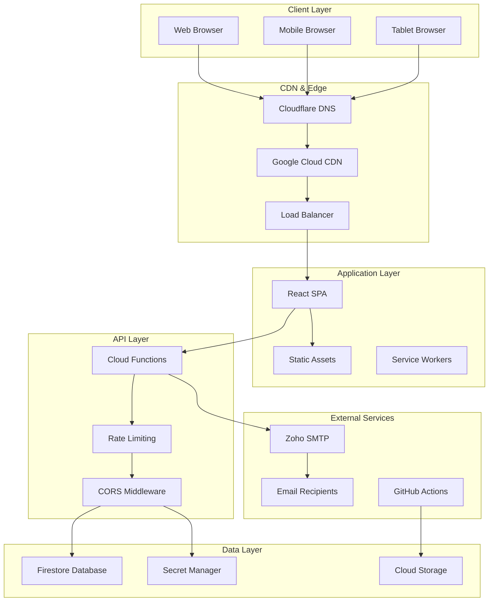
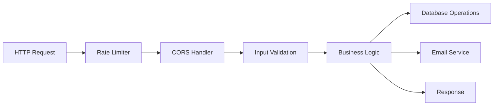
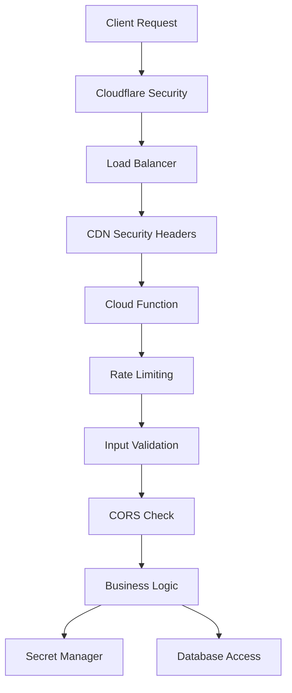
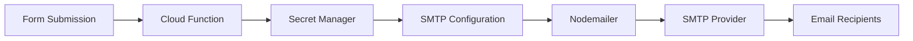
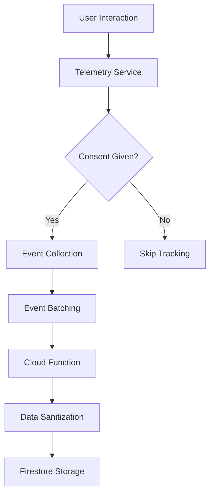
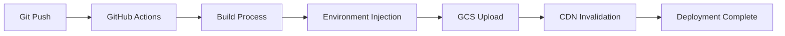
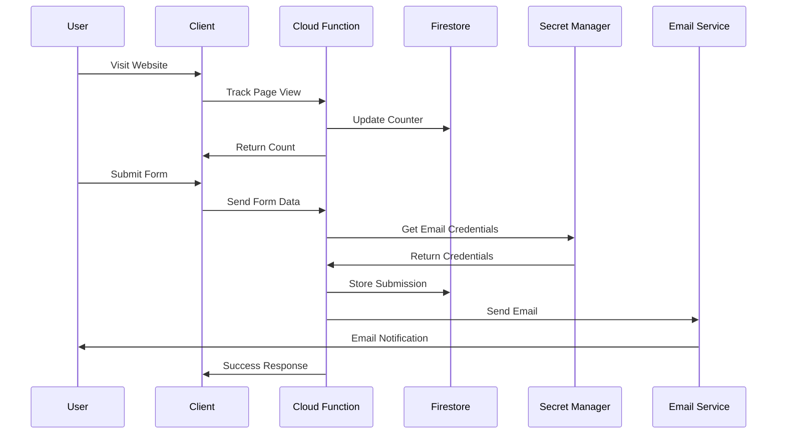

# 🏗️ Portfolio Website Architecture

## Overview

This document provides a comprehensive overview of the architecture, design decisions, and technical implementation of the personal portfolio website deployed at [www.sudharsana.dev](https://www.sudharsana.dev).

## 🎯 System Design Principles

### Core Principles
- **Scalability:** Serverless architecture for automatic scaling
- **Security:** Defense in depth with multiple security layers
- **Performance:** CDN-accelerated static hosting with optimized delivery
- **Privacy:** CCPA-compliant analytics with user consent
- **Maintainability:** Modular React components with clear separation of concerns
- **Reliability:** Google Cloud Platform's enterprise-grade infrastructure

## 🏛️ High-Level Architecture



## 🎨 Frontend Architecture

### React Application Structure
```
src/
├── components/           # Reusable UI components
│   ├── About.js         # About section component
│   ├── Contact.js       # Contact section with form
│   ├── ContactForm.js   # Contact form component
│   ├── Experience.js    # Professional experience
│   ├── Feedback.js      # Feedback form component
│   ├── FloatingFeedback.js # Floating feedback button
│   ├── Footer.js        # Site footer
│   ├── Header.js        # Navigation header
│   ├── Hero.js          # Hero section
│   ├── InterestSection.js # Job interest section
│   ├── JobDescriptionAnalyzer.js # Job analysis tool
│   ├── Skills.js        # Skills showcase
│   └── TelemetryConsent.js # Privacy consent banner
├── services/            # Business logic services
│   └── telemetry.js     # Analytics service
├── utils/               # Utility functions
│   └── env.js          # Environment configuration
├── data.js             # Static data and resume info
├── App.js              # Main application component
└── index.js            # Application entry point
```

### Component Design Patterns
- **Functional Components:** Modern React with hooks
- **Custom Hooks:** Reusable state logic
- **Context API:** Global state management
- **CSS Modules:** Scoped styling
- **Responsive Design:** Mobile-first approach

### State Management
- **Local State:** `useState` for component-specific state
- **Global State:** Context API for shared state
- **Persistence:** `localStorage` for user preferences
- **Session State:** `sessionStorage` for temporary data

## ⚙️ Backend Architecture

### Cloud Functions Overview


### Function Specifications

#### 1. Page View Tracker (`pageView`)
- **Purpose:** Track website visits and milestone celebrations
- **Trigger:** HTTP GET request
- **Rate Limit:** 10 requests per minute per IP
- **Database:** Updates `pageViews` collection
- **Response:** View count and special messages

#### 2. Contact Form Handler (`submitContactForm`)
- **Purpose:** Process contact form submissions
- **Trigger:** HTTP POST request
- **Rate Limit:** 5 requests per hour per IP
- **Features:**
  - Input validation and sanitization
  - Email notifications to multiple recipients
  - Firestore storage
  - Error handling and logging

#### 3. Feedback Handler (`submitFeedback`)
- **Purpose:** Process user feedback with star ratings
- **Trigger:** HTTP POST request
- **Rate Limit:** 3 requests per hour per IP
- **Features:**
  - Star rating validation
  - Rich HTML email formatting
  - Anonymous feedback support
  - Firestore storage

#### 4. Job Analyzer (`analyzeJobDescription`)
- **Purpose:** AI-powered job description analysis
- **Trigger:** HTTP POST request
- **Rate Limit:** 10 requests per hour per IP
- **Features:**
  - Resume data integration
  - Keyword matching algorithms
  - Interest scoring system
  - Qualification reasoning

#### 5. Telemetry Tracker (`trackTelemetry`)
- **Purpose:** CCPA-compliant user interaction tracking
- **Trigger:** HTTP POST request
- **Rate Limit:** 100 requests per hour per IP
- **Features:**
  - Batched event processing
  - Data sanitization
  - Session management
  - Privacy compliance

## 🗄️ Data Architecture

### Firestore Collections

#### `pageViews`
```javascript
{
  count: number,
  lastUpdated: timestamp
}
```

#### `feedbackCollect`
```javascript
{
  name: string,
  email: string,
  feedback: string,
  rating: number,
  timestamp: timestamp
}
```

#### `contactSubmissions`
```javascript
{
  name: string,
  email: string,
  subject: string,
  message: string,
  timestamp: timestamp
}
```

#### `jobAnalyses`
```javascript
{
  jobDescription: string,
  analysis: {
    interestScore: number,
    qualifications: string[],
    disinterestReasons: string[],
    matchPercentage: number
  },
  timestamp: timestamp
}
```

#### `telemetry`
```javascript
{
  userId: string,
  sessionId: string,
  eventType: string,
  timestamp: timestamp,
  // ... additional event data
}
```

#### `telemetry_sessions`
```javascript
{
  userId: string,
  sessionId: string,
  lastActivity: timestamp,
  eventCount: number,
  userAgent: string,
  ip: string
}
```

## 🔐 Security Architecture

### Multi-Layer Security Model



### Security Implementations

#### 1. Network Security
- **Cloudflare:** DDoS protection, WAF, bot management
- **HTTPS Only:** TLS 1.3 encryption
- **Security Headers:** CSP, HSTS, X-Frame-Options
- **CORS:** Restricted cross-origin access

#### 2. Application Security
- **Rate Limiting:** Per-IP request throttling
- **Input Validation:** Sanitized user inputs
- **Error Handling:** No sensitive data exposure
- **Authentication:** Service account-based access

#### 3. Data Security
- **Secret Manager:** Encrypted credential storage
- **Database Security:** Firestore security rules
- **Data Encryption:** At-rest and in-transit encryption
- **Access Control:** IAM-based permissions

#### 4. Privacy Compliance
- **CCPA Compliance:** User consent management
- **Data Minimization:** Only essential data collection
- **User Rights:** Opt-out and data deletion
- **Transparency:** Clear privacy policies

## 📧 Email System Architecture

### Email Flow


### Email Types

#### Contact Form Emails
- **Subject:** "New Contact Form Submission"
- **Recipients:** Configurable primary + CC recipients
- **Content:** Formatted HTML with user details
- **Security:** SMTP authentication via Secret Manager

#### Feedback Emails
- **Subject:** "🌟 New Portfolio Feedback - X/5 Stars"
- **Recipients:** Configurable primary + CC recipients
- **Content:** Rich HTML with star ratings and feedback
- **Features:** Professional formatting and styling

## 📊 Analytics Architecture

### Telemetry System Design



### Privacy-First Analytics
- **Consent Management:** User-controlled tracking
- **Data Anonymization:** No PII collection
- **Session Tracking:** Unique session identification
- **Event Batching:** Efficient data transmission
- **Data Retention:** Configurable cleanup policies

## 🚀 Deployment Architecture

### CI/CD Pipeline


### Deployment Strategy
- **Frontend:** Automated deployment via GitHub Actions
- **Backend:** Manual deployment of Cloud Functions
- **Infrastructure:** Infrastructure as Code (IaC)
- **Monitoring:** Cloud Logging and Monitoring

## 🔄 Data Flow Architecture

### User Interaction Flow


## 📈 Performance Architecture

### Optimization Strategies
- **CDN Acceleration:** Global content delivery
- **Static Hosting:** Fast loading times
- **Image Optimization:** Compressed and responsive images
- **Code Splitting:** Efficient bundle loading
- **Caching Strategy:** Optimized cache headers
- **Lazy Loading:** On-demand component loading

### Performance Metrics
- **Core Web Vitals:** Optimized for Google's metrics
- **Lighthouse Score:** 90+ performance rating
- **Load Time:** < 2 seconds initial load
- **Time to Interactive:** < 3 seconds
- **Cumulative Layout Shift:** < 0.1

## 🔧 Configuration Management

### Environment Configuration
- **Development:** `.env.local` for local development
- **Production:** Injected via GitHub Actions
- **Backend:** `functions/config.js` for Cloud Functions
- **Secrets:** Google Secret Manager for sensitive data

### Configuration Files
- `package.json`: Dependencies and scripts
- `functions/package.json`: Backend dependencies
- `.github/workflows/deploy.yml`: CI/CD pipeline
- `public/index.html`: HTML template and meta tags

## 🛠️ Development Architecture

### Development Workflow
1. **Local Development:** React development server
2. **Backend Testing:** Firebase emulator suite
3. **Code Quality:** ESLint and Prettier
4. **Version Control:** Git with feature branches
5. **Testing:** Manual testing and validation
6. **Deployment:** Automated via GitHub Actions

### Code Organization
- **Modular Components:** Reusable React components
- **Service Layer:** Business logic separation
- **Utility Functions:** Shared helper functions
- **Configuration:** Environment-specific settings
- **Documentation:** Comprehensive inline documentation

## 🔍 Monitoring & Observability

### Logging Strategy
- **Application Logs:** Cloud Functions logging
- **Error Tracking:** Structured error logging
- **Performance Monitoring:** Request timing and metrics
- **Security Logs:** Access and authentication logs

### Monitoring Tools
- **Google Cloud Logging:** Centralized log management
- **Cloud Monitoring:** Performance and availability metrics
- **Error Reporting:** Automatic error detection
- **Uptime Monitoring:** Service availability tracking

## 🎯 Future Architecture Considerations

### Scalability Improvements
- **Microservices:** Potential service decomposition
- **Caching Layer:** Redis for improved performance
- **Database Optimization:** Query optimization and indexing
- **CDN Enhancement:** Advanced caching strategies

### Feature Enhancements
- **Real-time Features:** WebSocket integration
- **Advanced Analytics:** Machine learning insights
- **API Gateway:** Centralized API management
- **Multi-region Deployment:** Global availability

## 📚 Technology Stack Summary

### Frontend
- React 18, CSS3, Lucide React, SweetAlert2, React Confetti, UUID

### Backend
- Google Cloud Functions (Node.js 20), Firebase Firestore, Google Secret Manager, Nodemailer

### Infrastructure
- Google Cloud Platform, Cloudflare, GitHub Actions, Google Cloud Storage, Google Cloud CDN

### Security
- CORS, Rate Limiting, CSP, Secret Management, Input Validation, CCPA Compliance

This architecture provides a robust, scalable, and secure foundation for the portfolio website while maintaining excellent performance and user experience.
