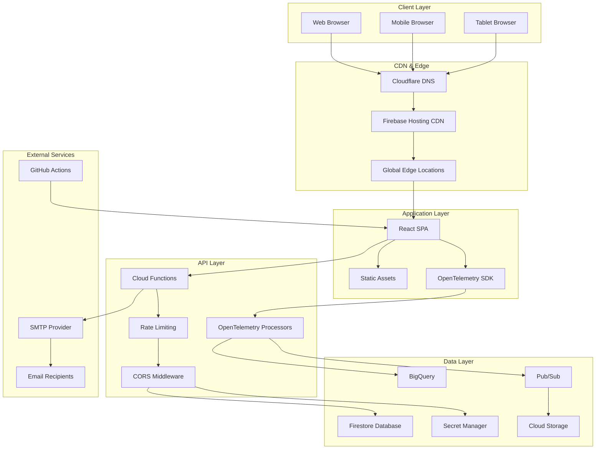
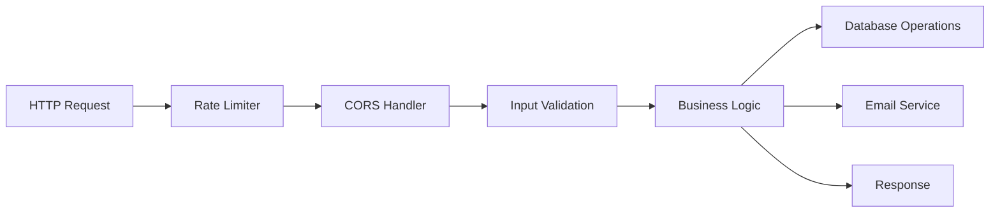
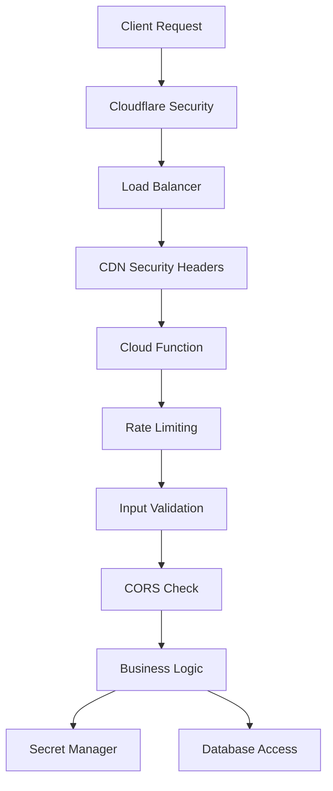
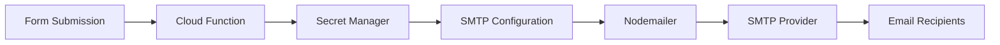
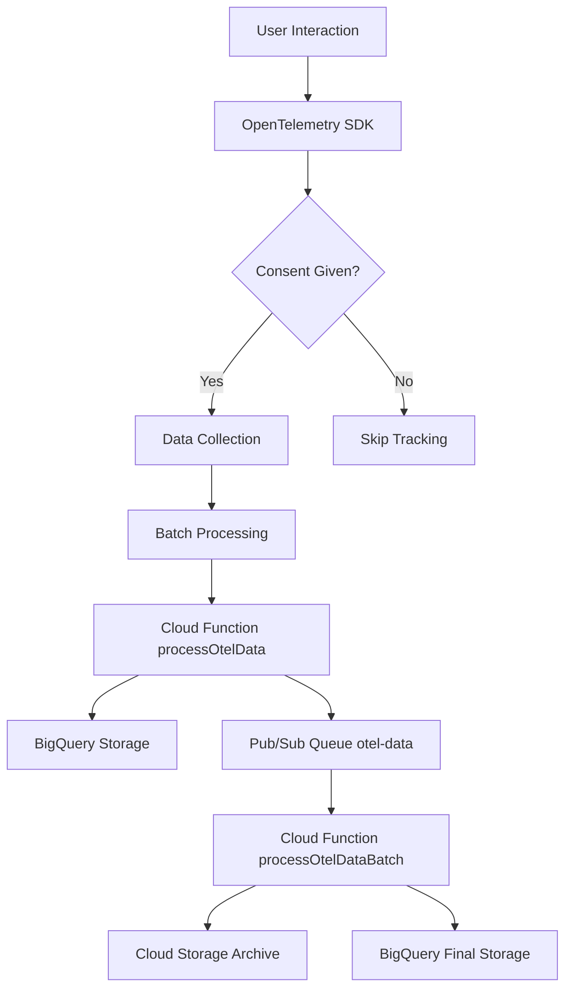
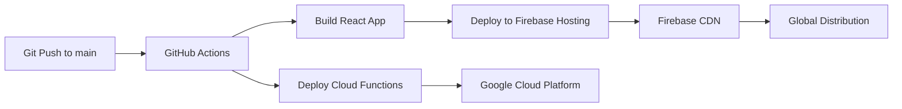
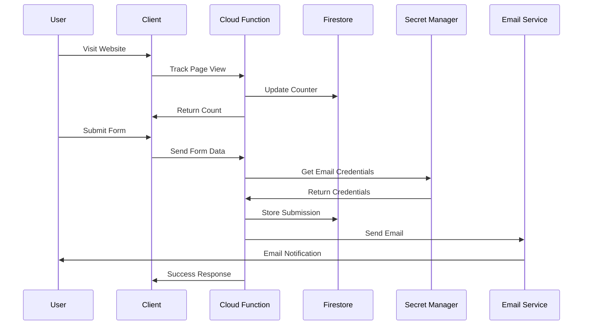

# 🏗️ Portfolio Website Architecture

## Overview

This document provides a comprehensive overview of the architecture, design decisions, and technical implementation of the personal portfolio website deployed at [www.sudharsana.dev](https://www.sudharsana.dev).

## 🎯 System Design Principles

### Core Principles
- **Scalability:** Serverless architecture for automatic scaling
- **Security:** Defense in depth with multiple security layers
- **Performance:** CDN-accelerated static hosting with optimized delivery
- **Privacy:** CCPA-compliant analytics with user consent
- **Maintainability:** Modular React components with clear separation of concerns
- **Reliability:** Google Cloud Platform's enterprise-grade infrastructure

## 🏛️ High-Level Architecture



## 🎨 Frontend Architecture

### React Application Structure
```
src/
├── components/           # Reusable UI components
│   ├── About.js         # About section component
│   ├── Contact.js       # Contact section with form
│   ├── ContactForm.js   # Contact form component
│   ├── Experience.js    # Professional experience
│   ├── Feedback.js      # Feedback form component
│   ├── FloatingFeedback.js # Floating feedback button
│   ├── Footer.js        # Site footer
│   ├── Header.js        # Navigation header
│   ├── Hero.js          # Hero section
│   ├── InterestSection.js # Job interest section
│   ├── JobDescriptionAnalyzer.js # Job analysis tool
│   ├── Skills.js        # Skills showcase
│   └── TelemetryConsent.js # Privacy consent banner
├── services/            # Business logic services
│   └── opentelemetry.js # OpenTelemetry implementation with full tracking
├── utils/               # Utility functions
│   └── env.js          # Environment configuration
├── data.js             # Static data and resume info
├── App.js              # Main application component
└── index.js            # Application entry point
```

### Component Design Patterns
- **Functional Components:** Modern React with hooks
- **Custom Hooks:** Reusable state logic
- **Context API:** Global state management
- **CSS Modules:** Scoped styling
- **Responsive Design:** Mobile-first approach

### State Management
- **Local State:** `useState` for component-specific state
- **Global State:** Context API for shared state
- **Persistence:** `localStorage` for user preferences
- **Session State:** `sessionStorage` for temporary data

## ⚙️ Backend Architecture

### Cloud Functions Overview


### Function Specifications

#### 1. Page View Tracker (`pageView`)
- **Purpose:** Track website visits and milestone celebrations
- **Trigger:** HTTP GET request
- **Rate Limit:** 10 requests per minute per IP
- **Database:** Updates `pageViews` collection
- **Response:** View count and special messages

#### 2. Contact Form Handler (`submitContactForm`)
- **Purpose:** Process contact form submissions
- **Trigger:** HTTP POST request
- **Rate Limit:** 5 requests per hour per IP
- **Features:**
  - Input validation and sanitization
  - Email notifications to multiple recipients
  - Firestore storage
  - Error handling and logging

#### 3. Feedback Handler (`submitFeedback`)
- **Purpose:** Process user feedback with star ratings
- **Trigger:** HTTP POST request
- **Rate Limit:** 3 requests per hour per IP
- **Features:**
  - Star rating validation
  - Rich HTML email formatting
  - Anonymous feedback support
  - Firestore storage

#### 4. Job Analyzer (`analyzeJobDescription`)
- **Purpose:** AI-powered job description analysis
- **Trigger:** HTTP POST request
- **Rate Limit:** 10 requests per hour per IP
- **Features:**
  - Resume data integration
  - Keyword matching algorithms
  - Interest scoring system
  - Qualification reasoning

#### 5. OpenTelemetry Data Processor (`processOtelData`)
- **Purpose:** Process incoming OpenTelemetry data (traces, metrics, logs)
- **Trigger:** HTTP POST request from OpenTelemetry SDK
- **Rate Limit:** 200 requests per minute per IP
- **Features:**
  - Real-time data processing
  - BigQuery integration for analytics
  - Pub/Sub publishing for batch processing
  - Cloud Storage archival
  - Data validation and sanitization

#### 6. OpenTelemetry Batch Processor (`processOtelDataBatch`)
- **Purpose:** Process batched OpenTelemetry data from Pub/Sub
- **Trigger:** Pub/Sub message from `otel-data` topic
- **Features:**
  - Batch data processing
  - Cloud Storage archival
  - Error handling and retry logic
  - Data compression and optimization

## 🗄️ Data Architecture

### Firestore Collections

#### `pageViews`
```javascript
{
  count: number,
  lastUpdated: timestamp
}
```

#### `feedbackCollect`
```javascript
{
  name: string,
  email: string,
  feedback: string,
  rating: number,
  timestamp: timestamp
}
```

#### `contactSubmissions`
```javascript
{
  name: string,
  email: string,
  subject: string,
  message: string,
  timestamp: timestamp
}
```

#### `jobAnalyses`
```javascript
{
  jobDescription: string,
  analysis: {
    interestScore: number,
    qualifications: string[],
    disinterestReasons: string[],
    matchPercentage: number
  },
  timestamp: timestamp
}
```

#### `telemetry` (Custom Analytics)
```javascript
{
  userId: string,
  sessionId: string,
  eventType: string,
  timestamp: timestamp,
  // ... additional event data
}
```

#### `telemetry_sessions`
```javascript
{
  userId: string,
  sessionId: string,
  lastActivity: timestamp,
  eventCount: number,
  userAgent: string,
  ip: string
}
```

#### OpenTelemetry Tables (BigQuery)

##### `traces`
```sql
trace_id: STRING,
span_id: STRING,
parent_span_id: STRING,
name: STRING,
start_time: TIMESTAMP,
end_time: TIMESTAMP,
duration_ms: INTEGER,
status_code: STRING,
status_message: STRING,
attributes: JSON,
events: JSON,
links: JSON,
resource_attributes: JSON,
instrumentation_scope_name: STRING,
instrumentation_scope_version: STRING,
created_at: TIMESTAMP
```

##### `metrics`
```sql
metric_name: STRING,
metric_type: STRING,
value: FLOAT,
timestamp: TIMESTAMP,
attributes: JSON,
resource_attributes: JSON,
created_at: TIMESTAMP
```

##### `logs`
```sql
log_id: STRING,
timestamp: TIMESTAMP,
severity: STRING,
body: STRING,
attributes: JSON,
resource_attributes: JSON,
trace_id: STRING,
span_id: STRING,
created_at: TIMESTAMP
```

## 🔐 Security Architecture

### Multi-Layer Security Model



### Security Implementations

#### 1. Network Security
- **Cloudflare:** DDoS protection, WAF, bot management
- **HTTPS Only:** TLS 1.3 encryption
- **Security Headers:** CSP, HSTS, X-Frame-Options
- **CORS:** Restricted cross-origin access

#### 2. Application Security
- **Rate Limiting:** Per-IP request throttling
- **Input Validation:** Sanitized user inputs
- **Error Handling:** No sensitive data exposure
- **Authentication:** Service account-based access

#### 3. Data Security
- **Secret Manager:** Encrypted credential storage
- **Database Security:** Firestore security rules
- **Data Encryption:** At-rest and in-transit encryption
- **Access Control:** IAM-based permissions

#### 4. Privacy Compliance
- **CCPA Compliance:** User consent management
- **Data Minimization:** Only essential data collection
- **User Rights:** Opt-out and data deletion
- **Transparency:** Clear privacy policies

## 📧 Email System Architecture

### Email Flow


### Email Types

#### Contact Form Emails
- **Subject:** "New Contact Form Submission"
- **Recipients:** Configurable primary + CC recipients
- **Content:** Formatted HTML with user details
- **Security:** SMTP authentication via Secret Manager

#### Feedback Emails
- **Subject:** "🌟 New Portfolio Feedback - X/5 Stars"
- **Recipients:** Configurable primary + CC recipients
- **Content:** Rich HTML with star ratings and feedback
- **Features:** Professional formatting and styling

## 📊 Analytics Architecture

### OpenTelemetry Pipeline



### OpenTelemetry Implementation

#### Frontend SDK Integration
- **Library:** Unified OpenTelemetry implementation (replaces dual telemetry systems)
- **Instrumentation:** Automatic and manual instrumentation with user interaction tracking
- **Data Types:** Traces, Metrics, and Logs with comprehensive event coverage
- **Consent Management:** CCPA-compliant opt-in system with dynamic consent control
- **Performance:** Non-blocking data collection with smart batching (no automatic intervals)

#### Data Collection Types

##### Traces (Distributed Tracing)
- **Page Navigation:** User journey tracking
- **User Interactions:** Click events, form submissions
- **Performance Metrics:** Page load times, render performance
- **API Calls:** Cloud Function request/response timing
- **Custom Spans:** Business logic instrumentation

##### Metrics (Observability Metrics)
- **Core Web Vitals:** LCP, FID, CLS measurements
- **Custom Business Metrics:** User engagement, feature usage
- **System Performance:** Memory usage, CPU utilization
- **Error Rates:** JavaScript errors, API failures
- **User Experience:** Session duration, bounce rate

##### Logs (Structured Logging)
- **JavaScript Errors:** Unhandled exceptions, promise rejections
- **User Actions:** Navigation events, form interactions
- **Debug Information:** Performance bottlenecks, debugging data
- **Security Events:** Suspicious activities, rate limit violations

### Data Processing Pipeline

#### Real-time Processing (`processOtelData`)
- **HTTP Trigger:** Receives data from frontend SDK
- **Data Validation:** Schema validation and sanitization
- **BigQuery Insert:** Real-time data storage for analytics
- **Pub/Sub Publishing:** Queues data for batch processing
- **Error Handling:** Graceful failure handling and retries

#### Batch Processing (`processOtelDataBatch`)
- **Pub/Sub Trigger:** Processes queued data batches
- **Data Compression:** Optimizes storage and transfer
- **Cloud Storage Archive:** Long-term data retention
- **BigQuery Final Storage:** Processed data for analysis
- **Cleanup:** Removes processed messages from queue

### Privacy-First Analytics

#### CCPA Compliance
- **Consent Management:** Explicit user opt-in required
- **Data Minimization:** Only essential data collection
- **User Rights:** Opt-out and data deletion capabilities
- **Transparency:** Clear privacy policies and data usage

#### Data Protection
- **Anonymization:** No PII collection, hashed user IDs
- **Session Tracking:** Unique session identification
- **Data Retention:** Configurable cleanup policies
- **Encryption:** Data encrypted in transit and at rest

#### Performance Optimization
- **Event Batching:** Efficient data transmission (5-second intervals)
- **Sampling:** 10% trace sampling to stay within free tier limits
- **Async Processing:** Non-blocking data collection
- **Error Resilience:** Graceful degradation on failures

## 🚀 Deployment Architecture

### CI/CD Pipeline


### Frontend Deployment (Firebase Hosting)
- **Platform:** Firebase Hosting with global CDN
- **Process:** Automated via GitHub Actions on `main` branch pushes
- **Build:** React production build with optimized assets
- **CDN:** Firebase CDN for global content delivery
- **Cache Control:** Optimized caching headers for static assets
- **Custom Domain:** www.sudharsana.dev with SSL/TLS
- **Features:**
  - Automatic HTTPS with Let's Encrypt
  - Global edge locations for fast loading
  - Instant rollbacks and versioning
  - A/B testing capabilities

### Backend Deployment (Cloud Functions)
- **Platform:** Google Cloud Functions (Node.js 20)
- **Process:** Manual deployment via `gcloud functions deploy`
- **Runtime:** Node.js 20 (latest LTS)
- **Scalability:** Serverless, auto-scaling based on demand
- **Regions:** us-central1 for optimal performance
- **Memory:** 256MB-1GB depending on function requirements
- **Timeout:** 60-300 seconds based on processing needs

### Infrastructure as Code
- **Configuration:** Firebase configuration files
- **Secrets:** Google Secret Manager integration
- **Monitoring:** Google Cloud Logging and Monitoring
- **Security:** IAM roles and service accounts

## 🔄 Data Flow Architecture

### User Interaction Flow


## 📈 Performance Architecture

### Optimization Strategies
- **CDN Acceleration:** Global content delivery
- **Static Hosting:** Fast loading times
- **Image Optimization:** Compressed and responsive images
- **Code Splitting:** Efficient bundle loading
- **Caching Strategy:** Optimized cache headers
- **Lazy Loading:** On-demand component loading

### Performance Metrics
- **Core Web Vitals:** Optimized for Google's metrics
- **Lighthouse Score:** 90+ performance rating
- **Load Time:** < 2 seconds initial load
- **Time to Interactive:** < 3 seconds
- **Cumulative Layout Shift:** < 0.1

## 🔧 Configuration Management

### Environment Configuration
- **Development:** `.env.local` for local development
- **Production:** Injected via GitHub Actions
- **Backend:** `functions/config.js` for Cloud Functions
- **Secrets:** Google Secret Manager for sensitive data

### Configuration Files
- `package.json`: Dependencies and scripts
- `functions/package.json`: Backend dependencies
- `.github/workflows/deploy.yml`: CI/CD pipeline
- `public/index.html`: HTML template and meta tags

## 🛠️ Development Architecture

### Development Workflow
1. **Local Development:** React development server
2. **Backend Testing:** Firebase emulator suite
3. **Code Quality:** ESLint and Prettier
4. **Version Control:** Git with feature branches
5. **Testing:** Manual testing and validation
6. **Deployment:** Automated via GitHub Actions

### Code Organization
- **Modular Components:** Reusable React components
- **Service Layer:** Business logic separation
- **Utility Functions:** Shared helper functions
- **Configuration:** Environment-specific settings
- **Documentation:** Comprehensive inline documentation

## 🔍 Monitoring & Observability

### Logging Strategy
- **Application Logs:** Cloud Functions logging
- **Error Tracking:** Structured error logging
- **Performance Monitoring:** Request timing and metrics
- **Security Logs:** Access and authentication logs

### Monitoring Tools
- **Google Cloud Logging:** Centralized log management
- **Cloud Monitoring:** Performance and availability metrics
- **Error Reporting:** Automatic error detection
- **Uptime Monitoring:** Service availability tracking

## 🎯 Future Architecture Considerations

### Scalability Improvements
- **Microservices:** Potential service decomposition
- **Caching Layer:** Redis for improved performance
- **Database Optimization:** Query optimization and indexing
- **CDN Enhancement:** Advanced caching strategies

### Feature Enhancements
- **Real-time Features:** WebSocket integration
- **Advanced Analytics:** Machine learning insights
- **API Gateway:** Centralized API management
- **Multi-region Deployment:** Global availability

## 📚 Technology Stack Summary

### Frontend
- **React 18:** Modern JavaScript library for building user interfaces
- **CSS3:** Custom responsive styling with mobile-first design
- **Lucide React:** Beautiful and consistent icon library
- **SweetAlert2:** Elegant alerts and notifications
- **React Confetti:** Celebratory effects for special interactions
- **UUID:** Unique identifier generation for telemetry
- **OpenTelemetry SDK:** Custom observability implementation

### Backend & Infrastructure
- **Google Cloud Functions (Node.js 20):** Serverless backend functions
- **Firebase Firestore:** NoSQL document database
- **Firebase Hosting:** Static website hosting with global CDN
- **Google Secret Manager:** Secure credential storage
- **Nodemailer:** Email delivery system
- **Google Cloud BigQuery:** Data warehouse for analytics
- **Google Cloud Storage:** Long-term data archival
- **Google Cloud Pub/Sub:** Message queuing for telemetry data

### DevOps & Deployment
- **Google Cloud Platform:** Complete cloud infrastructure
- **Firebase Hosting:** Static website hosting with CDN
- **GitHub Actions:** Automated CI/CD pipeline
- **Cloudflare:** DNS and security proxy

### Analytics & Observability
- **OpenTelemetry:** Comprehensive observability with traces, metrics, and logs
- **Custom Telemetry System:** CCPA-compliant user interaction tracking
- **BigQuery Analytics:** Advanced analytics and data warehousing
- **Performance Monitoring:** Core Web Vitals and custom metrics

### Security & Privacy
- **CORS:** Cross-origin resource sharing
- **Rate Limiting:** API abuse prevention
- **Content Security Policy (CSP):** XSS protection
- **Secret Management:** Secure credential storage
- **Input Validation:** Data sanitization
- **CCPA Compliance:** Privacy-first analytics
- **Firebase Security Rules:** Database access control

### Email & Communication
- **SMTP Provider:** Configurable email service
- **Nodemailer:** Node.js email delivery
- **HTML Email Templates:** Professional formatting
- **Multi-recipient Support:** Primary and CC recipients

This architecture provides a robust, scalable, and secure foundation for the portfolio website while maintaining excellent performance, comprehensive observability, and user experience.
