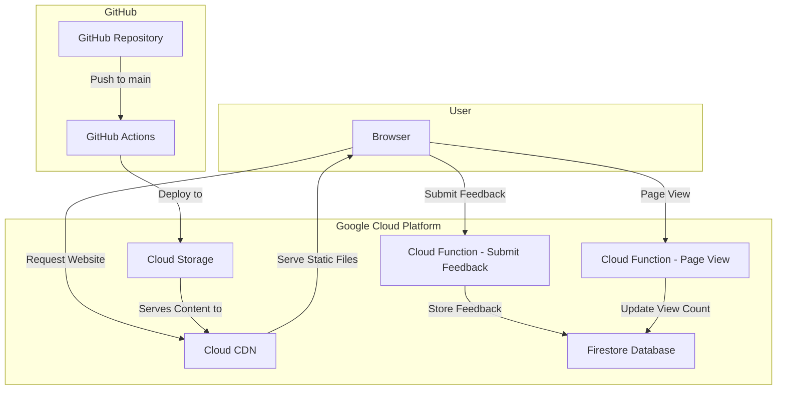
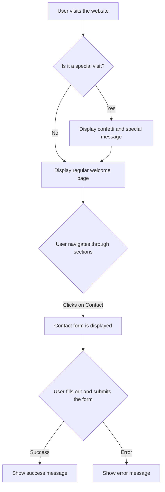

# Personal Portfolio Website

This is a personal portfolio website built to showcase my skills, experience, and projects. It's a single-page application that provides a comprehensive overview of my professional profile.

## Technologies Used

### Frontend

*   **React.js:** A JavaScript library for building user interfaces.
*   **Tailwind CSS:** A utility-first CSS framework for rapid UI development.
*   **Lucide React:** A library of beautiful and consistent icons.
*   **SweetAlert2:** A library for creating beautiful and responsive alerts.
*   **React Confetti:** A React component for creating a confetti effect.

### Backend

*   **Firebase Functions:** A serverless framework for running backend code in response to events.
*   **Node.js:** A JavaScript runtime for building server-side applications.
*   **Firebase Firestore:** A NoSQL document database for storing and syncing data.
*   **CORS:** A Node.js package for providing a Connect/Express middleware that can be used to enable CORS with various options.
*   **Firebase Functions Rate Limiter:** A middleware for rate-limiting requests to Firebase Functions.

### Deployment & DevOps

*   **Google Cloud Platform (GCP):** A suite of cloud computing services that runs on the same infrastructure that Google uses internally for its end-user products.
*   **Google Cloud Storage:** A scalable, fully-managed, and highly available object storage service.
*   **Google Cloud CDN:** A content delivery network that accelerates the delivery of web and video content.
*   **GitHub Actions:** A CI/CD platform for automating build, test, and deployment pipelines.

## Features

*   **Single-Page Application (SPA):** A single-page application that provides a seamless user experience.
*   **Responsive Design:** The website is fully responsive and works on all devices.
*   **Interactive UI:** The UI includes interactive elements and animations to engage users.
*   **Contact Form:** A contact form that allows users to send me a message. The form is connected to a serverless backend that stores the messages in a Firestore database.
*   **Special Effects:** The website includes special effects like confetti and sweet alerts to provide a unique user experience.
*   **Dynamic View Count:** The website tracks the number of page views and displays a special message for certain visitors.

## System Architecture

The following diagram illustrates the high-level architecture of the system:



## User Interaction Flow

The following flowchart illustrates the user's journey through the website:



## Local Development

To run this project locally, you will need to have Node.js and npm installed on your machine.

1.  **Clone the repository:**
    ```bash
    git clone https://github.com/your-username/your-repo-name.git
    cd your-repo-name
    ```

2.  **Install frontend dependencies:**
    ```bash
    npm install
    ```

3.  **Install backend dependencies:**
    ```bash
    cd functions
    npm install
    cd ..
    ```

4.  **Set up Firebase emulators (optional but recommended):**
    To test the backend functions locally, you can use the Firebase Local Emulator Suite.
    - Install the Firebase CLI: `npm install -g firebase-tools`
    - Initialize Firebase in your project: `firebase init`
    - Start the emulators: `firebase emulators:start`

5.  **Start the React application:**
    ```bash
    npm start
    ```
    The application will be available at `http://localhost:3000`.

## Deployment

### Frontend

The frontend is automatically deployed to Google Cloud Storage whenever changes are pushed to the `main` branch. The deployment pipeline is defined in the `.github/workflows/deploy.yml` file and includes the following steps:

1.  **Checkout code:** The code is checked out from the repository.
2.  **Set up Node.js:** Node.js is set up to the specified version.
3.  **Install dependencies:** The project dependencies are installed using `npm ci`.
4.  **Build React app:** The React application is built for production.
5.  **Authorize with Google Cloud:** The workflow authenticates with Google Cloud using a service account.
6.  **Deploy to GCS:** The build files are uploaded to a Google Cloud Storage bucket.
7.  **Invalidate CDN Cache:** The Cloud CDN cache is invalidated to ensure that the latest version of the website is served to users.

### Backend

The backend consists of two Cloud Functions: `pageView` and `submitFeedback`. These functions need to be deployed manually. For detailed instructions on how to deploy the functions and set up the API Gateway, please refer to the `gcp-deployment-instructions.md` file.

## Backend Details

The backend is built with Firebase Functions, a serverless compute service that lets you run backend code in response to events.

### Cloud Functions

*   **`pageView`:** This function is triggered whenever a user visits the website. It increments a counter in the Firestore database and returns a special message if the visitor is the 10th, 100th, 1000th, etc.
*   **`submitFeedback`:** This function is triggered when a user submits the contact form. It stores the user's message in the Firestore database and sends a confirmation email to the user.

### Rate Limiting

To prevent abuse, the `submitFeedback` function is protected by a rate limiter. The rate limiter is configured to allow a certain number of requests per IP address per hour.
