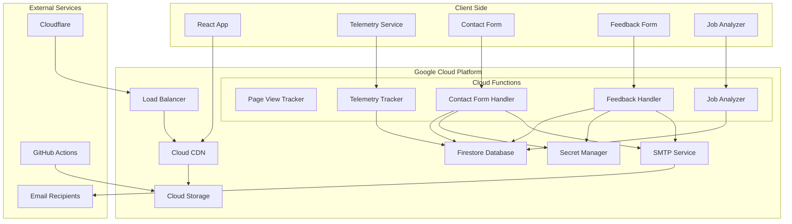
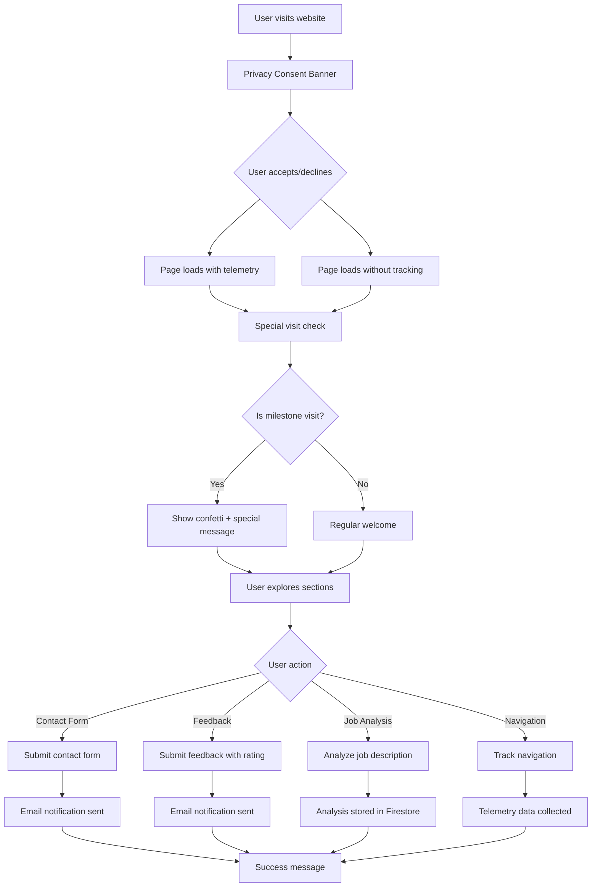

# Personal Portfolio Website

A modern, responsive portfolio website showcasing professional experience, skills, and projects. Built with React and deployed on Google Cloud Platform with comprehensive email notifications and analytics.

## 🌟 Live Website
**https://www.sudharsana.dev**

## Technologies Used

### Frontend
*   **React.js 18:** Modern JavaScript library for building user interfaces
*   **CSS3:** Custom responsive styling with mobile-first design
*   **Lucide React:** Beautiful and consistent icon library
*   **SweetAlert2:** Elegant alerts and notifications
*   **React Confetti:** Celebratory effects for special interactions
*   **UUID:** Unique identifier generation for telemetry

### Backend & Infrastructure
*   **Google Cloud Functions (Node.js 20):** Serverless backend functions
*   **Firebase Firestore:** NoSQL document database
*   **Google Secret Manager:** Secure credential storage
*   **Nodemailer:** Email delivery system
*   **CORS:** Cross-origin resource sharing
*   **Rate Limiting:** API abuse prevention

### Deployment & DevOps
*   **Google Cloud Platform:** Complete cloud infrastructure
*   **Google Cloud Storage:** Static website hosting
*   **Google Cloud CDN:** Global content delivery
*   **GitHub Actions:** Automated CI/CD pipeline
*   **Cloudflare:** DNS and security proxy

## ✨ Features

### Core Functionality
*   **Responsive Single-Page Application:** Seamless navigation with smooth scrolling
*   **Professional Portfolio Sections:** Hero, About, Skills, Experience, Contact
*   **Interactive UI Elements:** Animated components and hover effects
*   **Mobile-First Design:** Optimized for all device sizes

### Contact & Communication
*   **Contact Form:** "Get in Touch" form with email notifications
*   **Floating Feedback Button:** Star-rated feedback system with email alerts
*   **Email Notifications:** Automatic emails to multiple recipients
*   **Rate Limiting:** Protection against spam and abuse

### Analytics & Tracking
*   **Page View Counter:** Dynamic visitor tracking with special milestone messages
*   **Custom Telemetry System:** CCPA-compliant user interaction tracking
*   **Privacy-First Analytics:** Optional consent-based data collection
*   **Session Management:** Unique user and session identification

### Job Analysis Tool
*   **Job Description Analyzer:** AI-powered job matching system
*   **Resume Integration:** Personalized analysis based on professional profile
*   **Interest Scoring:** Intelligent matching with qualification reasons
*   **Firestore Storage:** Secure job description storage

### SEO & Performance
*   **SEO Optimized:** Meta tags, structured data, sitemap
*   **Fast Loading:** CDN-accelerated static hosting
*   **Security Headers:** CSP, security best practices
*   **Accessibility:** WCAG compliant design

## 🏗️ System Architecture



## 🔄 User Interaction Flow



## 🚀 Local Development

### Prerequisites
- Node.js 18+ and npm
- Google Cloud SDK (for backend functions)
- Git

### Setup Instructions

1. **Clone the repository:**
   ```bash
   git clone https://github.com/Sudhan30/my-portfolio-website.git
   cd my-portfolio-website
   ```

2. **Install frontend dependencies:**
   ```bash
   npm install
   ```

3. **Install backend dependencies:**
   ```bash
   cd functions
   npm install
   cd ..
   ```

4. **Set up environment variables:**
   Create `.env.local` file in the root directory:
   ```bash
   REACT_APP_GCP_PROJECT_ID=your-project-id
   REACT_APP_CLOUD_FUNCTIONS_URL=https://us-central1-your-project-id.cloudfunctions.net
   ```

5. **Start the development server:**
   ```bash
   npm start
   ```
   The application will be available at `http://localhost:3000`

### Backend Development
For local backend testing, use the Firebase emulator suite:
```bash
npm install -g firebase-tools
firebase init
firebase emulators:start
```

## 🚀 Deployment

### Frontend Deployment
Automated deployment via GitHub Actions on push to `main` branch:

1. **Build Process:** React app built for production
2. **Environment Injection:** Dynamic environment variables injected
3. **GCS Upload:** Static files uploaded to `www.sudharsana.dev` bucket
4. **CDN Invalidation:** Cloud CDN cache cleared for immediate updates
5. **Security Headers:** CSP and security headers applied

### Backend Deployment
Manual deployment of Cloud Functions:

```bash
# Deploy all functions
cd functions
gcloud functions deploy pageView --runtime nodejs20 --trigger-http --allow-unauthenticated
gcloud functions deploy submitFeedback --runtime nodejs20 --trigger-http --allow-unauthenticated
gcloud functions deploy submitContactForm --runtime nodejs20 --trigger-http --allow-unauthenticated
gcloud functions deploy analyzeJobDescription --runtime nodejs20 --trigger-http --allow-unauthenticated
gcloud functions deploy trackTelemetry --runtime nodejs20 --trigger-http --allow-unauthenticated
```

## 🔧 Backend Architecture

### Cloud Functions

| Function | Purpose | Features |
|----------|---------|----------|
| `pageView` | Track website visits | Milestone messages, rate limiting |
| `submitFeedback` | Handle feedback submissions | Email notifications, Firestore storage |
| `submitContactForm` | Process contact form | Email notifications, validation |
| `analyzeJobDescription` | AI job analysis | Resume matching, scoring system |
| `trackTelemetry` | User interaction tracking | CCPA compliance, batched events |

### Security Features
- **Rate Limiting:** Prevents API abuse
- **Secret Manager:** Secure credential storage
- **CORS Protection:** Cross-origin security
- **Input Validation:** Sanitized user inputs
- **Email Security:** SMTP with authentication

### Database Collections
- `pageViews`: Visitor counter and milestones
- `feedbackCollect`: User feedback submissions
- `contactSubmissions`: Contact form data
- `jobAnalyses`: Job description analyses
- `telemetry`: User interaction events
- `telemetry_sessions`: Session metadata

## 📧 Email System

### Configuration
- **SMTP Provider:** Zoho Mail
- **Sender:** sudhan@sudharsana.dev
- **Recipients:** 
  - Primary: sudhann.raj@gmail.com
  - CC: sudhan@sudharsana.dev, palaniappanshuruthi@gmail.com

### Email Types
1. **Contact Form:** Professional inquiry notifications
2. **Feedback:** Star-rated feedback with detailed formatting
3. **Security:** All credentials stored in Google Secret Manager

## 📊 Analytics & Privacy

### Telemetry System
- **CCPA Compliant:** Optional consent-based tracking
- **Privacy-First:** No PII collection, anonymized data
- **Event Tracking:** Clicks, navigation, form submissions
- **Session Management:** Unique user and session IDs
- **Data Storage:** Firestore with automatic cleanup

### Privacy Features
- **Consent Banner:** Clear privacy options
- **Data Minimization:** Only essential data collected
- **User Control:** Easy opt-out mechanism
- **Transparency:** Clear data usage policies

## 🛠️ Configuration Files

### Environment Setup
- `.env.local`: Local development variables
- `functions/config.js`: Backend configuration
- `functions/config.example.js`: Configuration template

### Documentation
- `EMAIL_SETUP.md`: Email system setup guide
- `ENVIRONMENT_SETUP.md`: Environment configuration
- `GITHUB_ACTIONS_DEPLOYMENT.md`: CI/CD documentation
- `TELEMETRY_SYSTEM.md`: Analytics system details
- `HERO_IMAGE_SETUP.md`: Image configuration guide

## 🔒 Security

### Implemented Security Measures
- **Content Security Policy (CSP):** XSS protection
- **Rate Limiting:** API abuse prevention
- **Input Validation:** Sanitized user inputs
- **Secret Management:** Encrypted credential storage
- **CORS Protection:** Cross-origin security
- **HTTPS Only:** Secure data transmission

### Compliance
- **CCPA:** California Consumer Privacy Act compliance
- **GDPR Ready:** European privacy regulation support
- **Security Headers:** Modern web security standards

## 📈 Performance

### Optimization Features
- **CDN Acceleration:** Global content delivery
- **Static Hosting:** Fast loading times
- **Image Optimization:** Compressed and responsive images
- **Code Splitting:** Efficient bundle loading
- **Caching Strategy:** Optimized cache headers

## 🤝 Contributing

1. Fork the repository
2. Create a feature branch (`git checkout -b feature/amazing-feature`)
3. Commit your changes (`git commit -m 'Add amazing feature'`)
4. Push to the branch (`git push origin feature/amazing-feature`)
5. Open a Pull Request

## 📄 License

This project is licensed under the MIT License - see the [LICENSE](LICENSE) file for details.

## 👨‍💻 Author

**Sudhan Raj** - Data Engineer
- Website: [www.sudharsana.dev](https://www.sudharsana.dev)
- LinkedIn: [linkedin.com/in/sudhan-raj](https://linkedin.com/in/sudhan-raj)
- Email: sudhan@sudharsana.dev

## 🙏 Acknowledgments

- React.js community for excellent documentation
- Google Cloud Platform for robust infrastructure
- Lucide React for beautiful icons
- All contributors and testers
